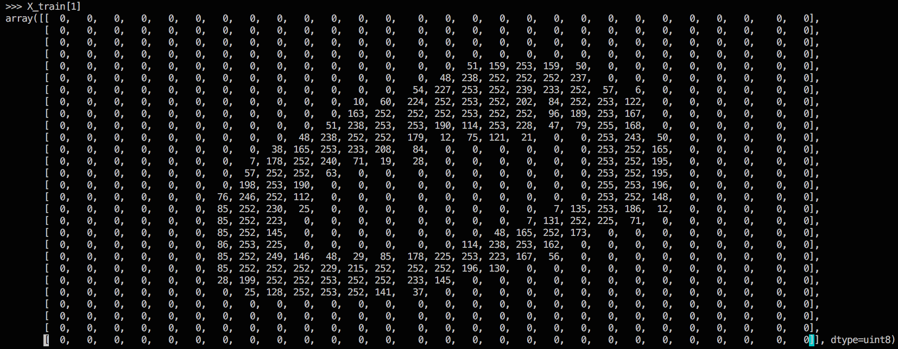
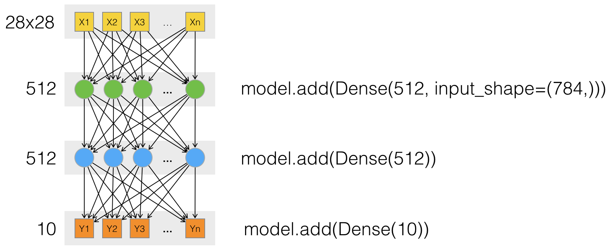

# 辨識 MNIST 資料集

- script: https://github.com/fchollet/keras/blob/master/examples/mnist_mlp.py
- dataset: https://s3.amazonaws.com/img-datasets/mnist.pkl.gz

## MNIST 資料集
包含 6 萬個訓練資料，與 1 萬個測試資料。每筆測試資料為 28x28 pixel 的灰階圖片，對應 0~9 的數字。

用法：
```python
from keras.datasets import mnist

(X_train, y_train), (X_test, y_test) = mnist.load_data()
```

回傳兩個 tuple：
- `X_train, X_test`: uint8 array of grayscale image data with shape `(nb_samples, 28, 28)`.
- `y_train, y_test`: uint8 array of digit labels (integers in range 0-9) with shape `(nb_samples,)`.

例如： X_train[1] 長下面這樣(每個0~255的數字對應一個灰階的pixel)，經過人工判讀 y_train[1] 為 0


## 使用 DNN 辨識 MNIST 資料集
完整程式碼: https://github.com/fchollet/keras/blob/master/examples/mnist_mlp.py

### 準備訓練/測試資料集
```python
# the data, shuffled and split between train and test sets
(X_train, y_train), (X_test, y_test) = mnist.load_data()  # 載入資料集

X_train = X_train.reshape(60000, 784)   # 處理 60000 筆訓練資料集, 將每筆資料從 28x28 的陣列轉換為 784x1 的陣列
X_test = X_test.reshape(10000, 784)     # 處理 10000 筆測試資料集, 將每筆資料從 28x28 的陣列轉換為 784x1 的陣列
X_train = X_train.astype('float32')     # 處理訓練資料集, 將陣列元素由 uint8 轉型為 float32
X_test = X_test.astype('float32')       # 處理測試資料集, 將陣列元素由 uint8 轉型為 float32
X_train /= 255                          # 處理訓練資料集, 調整陣列元素值範圍，使其介於 0 與 1 之間
X_test /= 255                           # 處理測試資料集, 調整陣列元素值範圍，使其介於 0 與 1 之間
```

### 準備訓練/測試結果
```python
# convert class vectors to binary class matrices
Y_train = np_utils.to_categorical(y_train, nb_classes)  # 對訓練資料集做 1-of-k coding
Y_test = np_utils.to_categorical(y_test, nb_classes)    # 對訓測試料集做 1-of-k coding
```

1-of-k 編碼: 假設變量可取的值有k種可能，如果對這些值用 1 到 k 的編碼，則可用長度為 k 的二元向量來表示一個變量的值。這個向量裡，取值對應的序號所在的元素為1，其餘元素為0。

例如，Y_train[1] 表示對應的圖片被辨識為 0。
```python
>>> Y_train[1]
array([ 1.,  0.,  0.,  0.,  0.,  0.,  0.,  0.,  0.,  0.])
```

> 如果圖片內容不是數值 0~9，而是 apple, banana, cherry...，輸出結果無法用數值表示，必須通過 1-of-k coding 將類別特徵表示為數字形式。

### 定義模型
```python
model = Sequential()                        # 使用 Sequential model：多層網路的線性堆疊

model.add(Dense(512, input_shape=(784,)))   # 增加全連接的網路層，輸出維度 512, 輸入維度 784
model.add(Activation('relu'))               # 對輸出層施加激活函數 ReLU
model.add(Dropout(0.2))                     # 對輸入層施加 dropout

model.add(Dense(512))                       # 增加全連接的網路層，輸出維度 512
model.add(Activation('relu'))               # 對輸出層施加激活函數 ReLU
model.add(Dropout(0.2))                     # 對輸入層施加 dropout

model.add(Dense(10))                        # 增加全連接的網路層，輸出維度 10
model.add(Activation('softmax'))            # 對輸出層施加激活函數 Softmax
```
- [`Sequential`](https://keras.io/getting-started/sequential-model-guide/): The Sequential model is a linear stack of layers.
- [`Dense`](https://keras.io/layers/core/#dense): Just your regular fully connected NN layer.
- [`Activation`](https://keras.io/layers/core/#activation): Applies an activation function to an output.
- [`Dropout`](https://keras.io/layers/core/#dropout): Applies Dropout to the input. Dropout consists in randomly setting a fraction p of input units to 0 at each update during training time, which helps prevent overfitting.



### 編譯模型
```python
model.compile(loss='categorical_crossentropy',        # 設定損失函數，評估準確度
              optimizer=RMSprop(),                    # 設定 optimizer，決定學習速度
              metrics=['accuracy'])                   # 設定 metrics，評斷模型效能
```
- `loss` is the objective that the model will try to minimize.
- `optimizer` is the string identifier of an existing optimizer (such as rmsprop or adagrad), or an instance of the  Optimizer class.
- `metrics`: For any classification problem you will want to set this to metrics=['accuracy'].

### 訓練模型
```python
history = model.fit(X_train,                          # 輸入資料
                    Y_train,                          # 標籤
                    batch_size=batch_size,            # 進行梯度下降(SGD)，每個 batch 包含的樣本數
                    nb_epoch=nb_epoch,                # 訓練幾輪
                    verbose=1,                        # 顯示訓練過程
                    validation_data=(X_test, Y_test)) # 驗證集
```

### 評估模型
```python
score = model.evaluate(X_test, Y_test, verbose=0)     # 使用驗證集為模型打分數
print('Test score:', score[0])                        # Test score: 0.124787330822
print('Test accuracy:', score[1])                     # Test accuracy: 0.9816
```

### 預測
辨識測試集第一個物件，預測圖形為 7 的機率最高，合乎人工辨識結果
```python
>>> model.predict(np.array([X_test[0]]))
array([[  4.70453768e-36,   3.92682681e-31,   7.19156835e-20,
          2.36387308e-16,   1.31915422e-34,   1.56847370e-24,
          0.00000000e+00,   1.00000000e+00,   7.94227930e-31,
          4.12907519e-21]], dtype=float32)
>>> Y_test[0]
array([ 0.,  0.,  0.,  0.,  0.,  0.,  0.,  1.,  0.,  0.])
```

## 使用 CNN 辨識 MNIST 資料集
完整程式碼: https://github.com/fchollet/keras/blob/master/examples/mnist_cnn.py

### 背景知識：[一文讀懂卷積神經網絡CNN](https://read01.com/7Rx00O.html)
“一般地，CNN的基本結構包括兩層，其一為特徵提取層，每個神經元的輸入與前一層的局部接受域相連，並提取該局部的特徵。一旦該局部特徵被提取後，它與其它特徵間的位置關係也隨之確定下來；其二是特徵映射層，網絡的每個計算層由多個特徵映射組成，每個特徵映射是一個平面，平面上所有神經元的權值相等。特徵映射結構採用影響函數核小的sigmoid函數作為卷積網絡的激活函數，使得特徵映射具有位移不變性。此外，由於一個映射面上的神經元共享權值，因而減少了網絡自由參數的個數。卷積神經網絡中的每一個卷積層都緊跟著一個用來求局部平均與二次提取的計算層，這種特有的兩次特徵提取結構減小了特徵解析度。”

### 準備訓練/測試資料集
```python
# the data, shuffled and split between train and test sets
(X_train, y_train), (X_test, y_test) = mnist.load_data()

if K.image_dim_ordering() == 'th':
    X_train = X_train.reshape(X_train.shape[0], 1, img_rows, img_cols) # (samples, channels, height, width)
    X_test = X_test.reshape(X_test.shape[0], 1, img_rows, img_cols)
    input_shape = (1, img_rows, img_cols)
else:
    X_train = X_train.reshape(X_train.shape[0], img_rows, img_cols, 1) # (samples, height, width, channels)
    X_test = X_test.reshape(X_test.shape[0], img_rows, img_cols, 1)
    input_shape = (img_rows, img_cols, 1)

X_train = X_train.astype('float32')     # 處理訓練資料集, 將陣列元素由 uint8 轉型為 float32
X_test = X_test.astype('float32')       # 處理測試資料集, 將陣列元素由 uint8 轉型為 float32
X_train /= 255                          # 處理訓練資料集, 調整陣列元素值範圍，使其介於 0 與 1 之間
X_test /= 255                           # 處理測試資料集, 調整陣列元素值範圍，使其介於 0 與 1 之間
```
- channels = 1 (灰階圖形)
- height = 28 (圖形高度, 幾個 row)
- width = 28 (圖形寬度, 幾個 column)

### 準備訓練/測試結果
```python
# convert class vectors to binary class matrices
Y_train = np_utils.to_categorical(y_train, nb_classes)  # 對訓練資料集做 1-of-k coding
Y_test = np_utils.to_categorical(y_test, nb_classes)    # 對訓測試料集做 1-of-k coding
```

### 定義模型
```python
model = Sequential()                                                  # 使用 Sequential model：多層網路的線性堆疊

model.add(Convolution2D(nb_filters, kernel_size[0], kernel_size[1],   # 增加一層 Convolution2D
                        border_mode='valid',
                        input_shape=input_shape))
model.add(Activation('relu'))                                         # 對輸出層施加激活函數 ReLU

model.add(Convolution2D(nb_filters, kernel_size[0], kernel_size[1]))  # 增加一層 Convolution2D
model.add(Activation('relu'))                                         # 對輸出層施加激活函數 ReLU

model.add(MaxPooling2D(pool_size=pool_size))                          # 增加一層 MaxPooling2D
model.add(Dropout(0.25))                                              # 對輸入層施加 dropout

model.add(Flatten())                                                  # 把之前的2D陣列打平成1D

model.add(Dense(128))                                                 # 增加全連接的網路層，輸出維度 128
model.add(Activation('relu'))                                         # 對輸出層施加激活函數 ReLU
model.add(Dropout(0.5))                                               # 對輸入層施加 dropout

model.add(Dense(nb_classes))                                          # 增加全連接的網路層，輸出維度 nb_classes(=10)
model.add(Activation('softmax'))                                      # 對輸出層施加激活函數 Softmax
```

### 編譯模型
```python
model.compile(loss='categorical_crossentropy',        # 設定損失函數，評估準確度
              optimizer='adadelta',                   # 設定 optimizer，決定學習速度
              metrics=['accuracy'])                   # 設定 metrics，評斷模型效能
```

### 訓練模型
```python
history = model.fit(X_train,                          # 輸入資料
                    Y_train,                          # 標籤
                    batch_size=batch_size,            # 進行梯度下降(SGD)，每個 batch 包含的樣本數
                    nb_epoch=nb_epoch,                # 訓練幾輪
                    verbose=1,                        # 顯示訓練過程
                    validation_data=(X_test, Y_test)) # 驗證集
```

### 評估模型
```python
score = model.evaluate(X_test, Y_test, verbose=0)     # 使用驗證集為模型打分數
print('Test score:', score[0])                        # Test score: 0.0319485836154
print('Test accuracy:', score[1])                     # Test accuracy: 0.9897
```

## 後記

Keras 包裝了 TensorFlow 與 Theano，提供方便使用的 API，透過 python 編程幾乎沒有操作上的障礙，好比倚天劍、屠龍刀在手。然而，由於本身缺乏基礎知識等於沒有內功，揮劍斬雞或許可以，面對強敵便顯得捉襟見肘，在需要微調、除錯、最佳化時往往不知所措。
